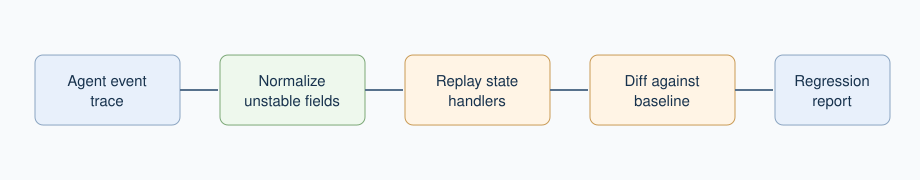

# Agent Trajectory Replay for Debugging Tool-Using AI Workflow Regressions

Mukunda Rao Katta

## Abstract

Tool-using AI agents are difficult to debug because a failure may emerge from a sequence of planning steps, tool calls, intermediate errors, and final-output decisions rather than from a single response. This paper presents Agent Trajectory Replay, a small zero-dependency JavaScript package for summarizing, replaying, and diffing agent event traces. The package removes unstable timing fields before comparison, counts tool calls and errors, exposes final-output changes, and allows event handlers to rebuild state from a recorded trajectory. The contribution is a lightweight regression-debugging pattern for teams that need a simple way to compare agent behavior across model, prompt, or tool changes.

## 1. Motivation

Agent systems combine reasoning, tool use, and intermediate state. Work such as ReAct made the coupling between reasoning and acting explicit [@yao2023react], while benchmark work such as AgentBench has highlighted the need to evaluate agents as interactive systems [@liu2023agentbench]. In daily engineering work, however, developers often need something smaller than a benchmark: a way to answer what changed between yesterday's successful run and today's failing run.

Agent trajectory replay treats an agent run as a list of events. The list can include planning steps, tool calls, observations, errors, and final outputs. Once captured, the trace can be summarized, replayed through handlers, or compared with another trace.

*Figure 1. Lightweight trajectory replay workflow for agent regression debugging.*

## 2. Implementation Basis

The implementation basis is `@mukundakatta/agent-trajectory-replay`, a zero-dependency ESM package. It exposes three functions.

- `summarizeTrajectory(events)` counts steps, tool calls, errors, and the final output.
- `diffTrajectories(left, right)` compares two traces after removing unstable timing fields.
- `replayTrajectory(events, handlers)` rebuilds state by applying handlers for each event type.

This is deliberately small. It is not a full observability platform. It is a compact regression lens that can be used in tests, local debugging, or small CI checks.

## 3. Method

The method has three stages. First, the system records an event list from an agent run. Second, it normalizes the list by removing timestamps and duration fields that are expected to change across runs. Third, it summarizes and diffs the stable event content.

This makes the comparison less noisy. A trace should not fail a regression check because a tool call took a different number of milliseconds. It should fail because the tool call changed, an error appeared, or the final output moved away from the expected result.

## 4. Review Dimensions

| Dimension | What it checks | Example signal | Why it matters |
| --- | --- | --- | --- |
| Tool sequence | Whether the same tools are called | search replaced by shell | exposes behavior drift |
| Error count | Whether new error events appear | one failed browser step | catches unstable integrations |
| Final output | Whether the final answer changed | missing citation | shows user-facing regression |
| Stable diff | Whether timing noise is ignored | duration changes removed | keeps tests useful |
| Replay state | Whether handlers can rebuild state | action log reconstructed | supports focused debugging |

## 5. Limits

Trajectory replay depends on the quality of captured events. If an agent logs too little, the replay is thin. If it logs too much, the diff becomes noisy. The method also does not judge semantic correctness by itself. It helps locate changes, after which a human, evaluator, or domain-specific check can decide whether the change is acceptable.

## 6. Conclusion

Agent systems need debugging tools that fit the size of the problem. Trajectory replay is a practical middle ground: more structured than reading logs by hand, much lighter than building a full observability stack. For small agent projects and evaluation harnesses, a stable event diff can make regressions visible before they reach users.

## References

References are provided in `paper.bib`.

